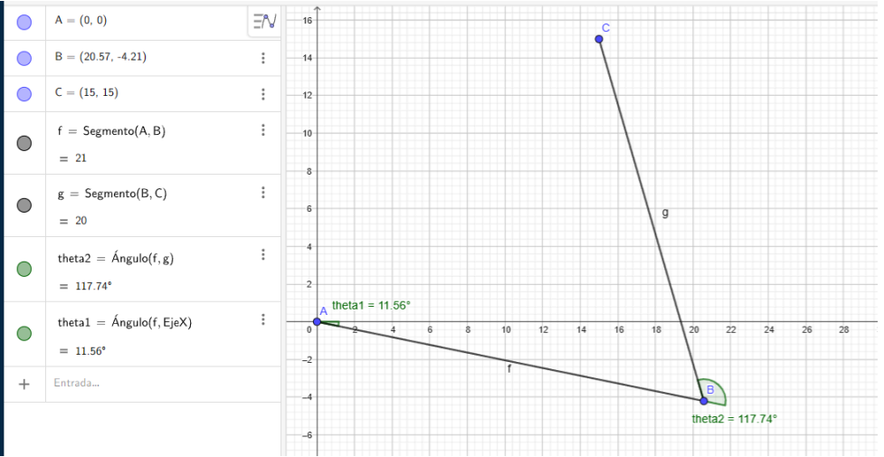
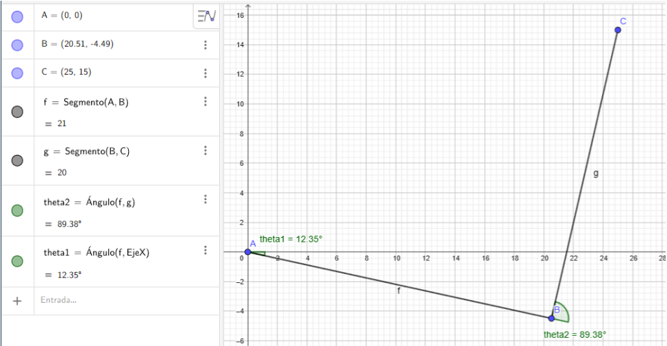
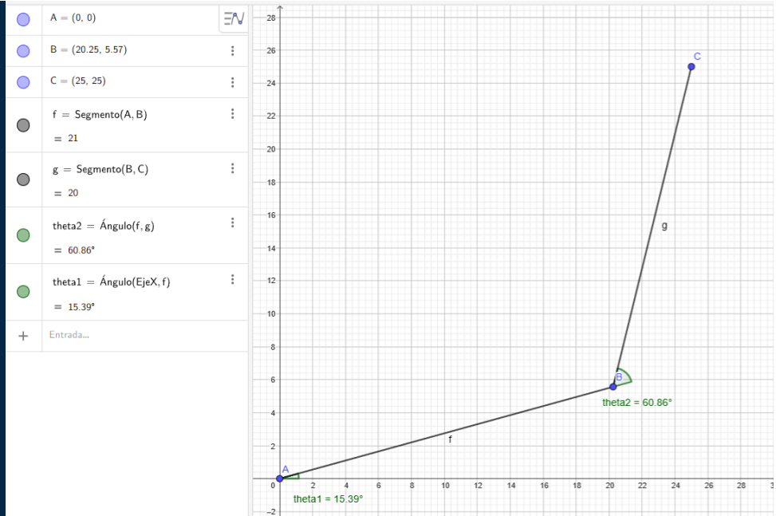
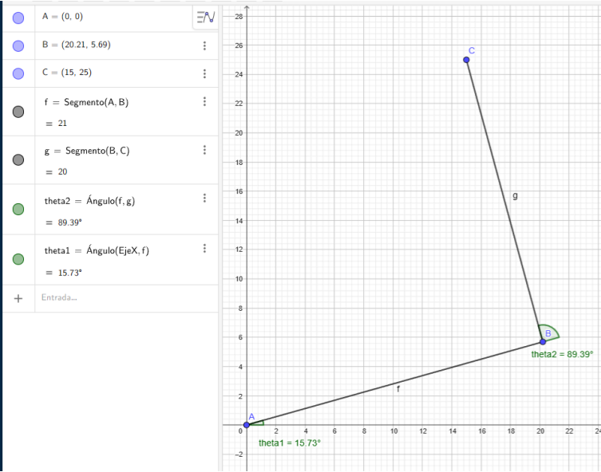

# Robotic Arm 3D Printer #

A robotic arm with 3 degrees of freedom will be made, one prismatic and two rotating, with a SCARA – PRR type distribution.
The stepper motors corresponding to each degree of freedom will be controlled through an Arduino Uno together with Pololu A4988 controllers.
A connection function via WIFI will be added with the integration of an ESP32 Cam, which communicates with the Arduino Uno, with which the G code file (.GCODE) of the part to be printed can be sent, and it will begin automatically . Communication between the computer where the G code is located and the ESP32 of the printer will be carried out through the website. With further development, it could be controlled over long distances through web pages, for example.
In a future application, the printing base could be replaced with a ribbon that withstands the extrusion temperature in order to have a level of serial production higher than most of the machines available on the market.

## Goals

This project seeks to design a 3D printing system different from the most common models on the market, such as the 3-axis printer or those with an infinite axis. In addition, it will have greater printing capacity in terms of the size of the prints it can make, since being an instrument widely used today, there is a need to print larger pieces at once.
It also seeks to improve the human-printer relationship through online communication, either to show the progress of the printing or to attach a new job without having to connect it to a PC or through a compatible memory card.
Another objective is to be able to build a printer that entails lower manufacturing costs in order to compete with other printers on the market that have a higher price for equal or inferior features.

## Summary

A robotic arm with 3 degrees of freedom will be developed, with a configuration of 1 prismatic axis that will be used for the vertical movement of the extruder, and 2 rotary axes in SCARA format.
The advantage of this configuration is that it gives us a 180° printing area, a reach of 41 cm (base can be modified according to characteristics) and a height of approximately 30 cm. In total it would be a printing area of [Printing area calculation].
The parts to be used will be made of PLA, since they were designed and printed in 3D, wood, for the supports and components that require greater resistance, and finally the electronic components are integrated.
The operation is based on sending the file with a .gcode extension that is obtained from any laminator on the market (such as Cura) through a web page, and which can be printed automatically without requiring physical access to the machine. It will also have a camera that can be accessed from the same website to see the progress of the 3D printing made by the arm.

## Technical specifications

- The robotic arm must have an adequate range of motion to cover the minimum print area of 300x300x300.
- The robotic arm must be equipped with an extrusion tool that can print both PLA and ABS and the head itself must be able to be easily exchanged
- It must be operated through a Wi-Fi network from a web page with a user-friendly interface which is capable of loading a direct parameterized file to print and be able to initialize the operation as well as be able to see the process in real time through the application.
- The wireless connection must be stable and secure to guarantee fluid communication between the printer and the application.
- The structure of the robotic arm must be robust and resistant to ensure stable and safe operation.
- The manufacturing cost of the robotic arm should be as low as possible without compromising the quality and efficiency of the system.
- The robotic arm should be easy to disassemble and maintain to facilitate repair and replacement of parts in case of failure.Principle of form
- The structure must be stable and of simple design that guarantees possible future sizing applications.

# Materials

| Material | Quantity |
|---|:---:|
| L298N | x3 |
| Stepper NEMA 17 |        x3|
| Cables |
| Arduino Uno |            x1|
| ESP32      |             x1|
| ESP32 CAM |              x1|
| Wood |
| Power Supply 12v / 5v |
| Pencil 3D Printer |      x1|
| Threaded Rod |           x1|

## Selection criteria for each material

### ARDUINO UNO
The Arduino was selected as the motherboard for the movement of the motors due to the large number of libraries that can be found on the market for this type of boards, in addition to the ease they provide when programming the movement sequence.
The ESP32 or the ESP32 CAM was not used directly since, although the libraries can be adapted to this type of boards, the use of Wi-Fi required multiple use of pins to connect to the Internet and also move the motors, which generated unwanted signals that produced unwanted movements in the motors or their non-functioning at all.

### ESP32
This board was selected since it offers us the possibility of connecting to the Internet through an integrated Wi-Fi connection without the need to incorporate integrated devices.

### ESP32 CAM
This board was selected due to a similar criterion as the ESP32, it provides us with an integrated camera capable of transmitting video via Wi-Fi without a physical connection to the equipment through an IP address of the device.

## Design Specifications
It will be constructed constructively from parts made in 3D printing and wood, mainly ignoring the electronic and transmission components, the design will be based on figure 1 with modifications according to the needs.
The 3D printed parts were designed by ourselves. An approach was taken that with the smallest amount of material possible a part could be generated with the same functionality and that would withstand the conditions to which it was subjected. A 20% infill configuration was used and the material to be used was PLA.

# Software a utilizar
Se usará lenguaje C para programar los siguientes componentes:
ESP32: El cual se utilizará para comunicar la página web donde se depositara el código con el ARDUINO UNO.
ARDUINO UNO: Se utilizará esta placa de desarrollo para la transformación del código recibido por el usuario a uno que el robot pueda utilizar, y además para el comando de los motores a utilizar.
ESP32 CAM: En este caso se utilizará desde la página web para el seguimiento de la impresión a distancia. 
También se utilizará una combinación de HTML y CSS para el diseño de la página web.

Los pasos a seguir para el funcionamiento completo del proyecto son:

1. Subida del archivo: Se sube el archivo que se quiere imprimir a la página web. Esta realiza un HTTP POST del contenido del archivo a un archivo de Google sheets 
2. Manejo desde Google Sheets: El archivo de Google Sheets está configurado para que cuando recibe un HTTP POST, obtenga todo el contenido que se le ha enviado y lo coloque por línea en la primera columna de la única hoja que se encuentra en el documento. De la misma forma, cuando recibe un HTTP GET, envía toda la información de la primera columna en un solo string, en el cual cada línea está separada por una coma. 
3. Obtención desde el ESP32: El ESP32 está programado para realizar un HTTP GET al archivo del Google Sheets. Cuando obtiene el string con el código subido, ejecuta una función que elimina todas las líneas innecesarias para el funcionamiento de los motores, ya sean pre configuraciones, manejo del extrusor, etc. 
4. Envío al ARDUINO UNO: Una vez filtrada toda la información, el ESP32 envía el nuevo string generado a través del puerto serie (TX y RX) hacia el ARDUINO UNO.
5. Este hace un segundo manejo del string en donde, por cada línea de comando del código, obtiene las posiciones de destino tanto de X como Y. 
6. Una vez obtenidas las posiciones, manda a llamar a la función que calcula la cantidad de pasos que debe realizar cada motor según nuestro sistema de movimiento.
7. Cuando calcula la cantidad de pasos manda a llamar a otra función que es la que comanda a los motores, diciendo que se muevan la cantidad de pasos calculados, junto con una configuración para manejar los tiempos de movimiento de cada motor.
8. Uso del ES32 CAM: El código del ESP32 CAM está seteado para funcionar a la inversa del ESP32, este genera una IP para la cámara que está integrada, y realiza un HTTP POST con su dirección IP a otro archivo de Google Sheets. 
9. Cuando la página web solicita ver el avance de la impresión, realiza primero un HTTP GET al archivo de Google Sheets donde esta la direccion IP de la cámara del ESP32 CAM, para dirigirse a esta y mostrar el video que está filmando el ESP32 CAM con el avance de la impresión. 

## Explanation of how the code works
### Code explanation for the Arduino Uno
We are going to stop specifically at this point in order to detail the method of operation of the transformation of the Cartesian positions obtained to the number of steps that each motor must move along with the speed at which they must do so.
``` sh
while (Serial.available() > 0 && MensajeRecibido==0) {
    receivedMessage = Serial.readStringUntil('\r');
    Serial.println("Mensaje Recibido");
    Serial.println(receivedMessage);
    //miCadena.indexOf(subCadena)
    if ( receivedMessage.indexOf(",") != -1 && receivedMessage.indexOf(";") != -1){
      MensajeRecibido=1;
    }
```
This code fragment is used to enable reading the Serial port of the arduino while waiting for the message sent by the ESP32 with the string that has the lines of code to be executed by the robot.

``` sh
void MatrizMovimientos(char texto[]){
  for (int i = 0; i < strlen(texto); i++) {
    if (texto[i] == ';') {
      filas++;
    }
  }
  char *token = strtok(texto, ",;");
  for (int i = 0; i < filas; i++) {
    for (int j = 0; j < columnas; j++) {
      Movimientos[i][j] = atoi(token);
      // Serial.print("Valor Leido: ");
      // Serial.println(Movimientos[i][j]);
      token = strtok(NULL, ",;");
    }
  }
```
Next, the first function to use is to generate the Movement Matrix, that is, a list is created with the final positions of each axis for each line of code received. This generates a list with 3 values in each element, these values being the final positions of (X, Y, Z) .

``` sh
void moverRobotSCARA(float x, float y) {
  // Función para mover el robot SCARA a una posición específica
  int cuadrante = 0; 
  x=abs(x);
  y=abs(y);

  float d = sqrt(x * x + y * y);
  float phi = atan2(y, x);
  // Calcular los ángulos de las articulaciones mediante cinemática inversa
  float theta2 = acos((d * d - L1 * L1 - L2 * L2) / (2 * L1 * L2));
  float theta1 = phi - atan2(L2 * sin(theta2), L1 + L2 * cos(theta2));
  // Convertir los ángulos a pasos para los motores paso a paso
  float avanzar1 = ((theta1 - ultimo_step1) * 360)/(2 * PI);
  float avanzar2 = ((theta2 - ultimo_step2) * 360)/(2 * PI);

  int steps1 = avanzar1 / avance_motor;
  int steps2 = avanzar2 / avance_motor;

  MoverBrazo(steps1, steps2);

  ultimo_step1 = steps1;
  ultimo_step2 = steps2;
}
```

In the case of the moveRobotSCARA function, it is the one that transforms the final positions into the number of steps for each motor, only in the case of motors 1 and 2 (that is why it has 2 input values), representatives of the X and Y axes. , since, as they were defined as rotary type axes, a transformation from Cartesian coordinates to polar coordinates is necessary for their use.
Due to the configuration of the axes, it was decided to use the geometric method to calculate the angles to rotate in each motor in order to make the calculation simpler. We can observe the development of this method in the first lines of the function; converting them to mathematical language they would be:

$$ d = x2+ y2 $$

Calculates the distance from the origin to the end point where the extruder is located

$$phi = arc tangent (y,x)$$

To calculate the angle at which the end point is with respect to the horizontal axis

$$theta2 = arc cosine((d * d - L1 * L1 - L2 * L2) / (2 * L1 * L2))$$

L1 and L2 represent the lengths of arms 1 and 2 respectively.
This formula is used to calculate the angle between arm 2 and the continuation of the center line of arm 1.

$$theta1 = phi - arctangent(L2 * sine(theta2), L1 + L2 * cosine(theta2))$$

Finally, the angle of arm 1 with respect to the horizontal axis is calculated.






Recreating the movement of the robot, the previous sequence of steps would look like:


With the sequence of end points (15,15); (25,15); (25,25); (15.25) the angles of theta1 and theta2 should be as follows:

```sh
  float avanzar1 = ((theta1 - ultimo_step1) * 360)/(2 * PI);
  float avanzar2 = ((theta2 - ultimo_step2) * 360)/(2 * PI);

  int steps1 = avanzar1 / avance_motor;
  int steps2 = avanzar2 / avance_moto
```
Next, the angles that each motor must advance (or retreat) are calculated. This is calculated by converting the calculated angles to geometric degrees, since they are initially found in non-representative values, that is, values that cannot be used as geometric degrees.
The angle at which the motor is currently located will also be subtracted, reflected in the variables ultimo_step1 and ultimo_step2, which, after each movement, will be updated. For example, if motor counterpart to advance1 but stops motor 2)
Finally, the number of degrees to move in each motor is divided by the degrees per step of the motor (in this case it would be 1.8 degrees per step, which is stored in the variable advance_motor), obtaining the number of steps to be performed to advance that number of geometric degrees.
```sh
MoverBrazo(steps1, steps2);
```
Once the entire series of calculations is finished, the MoveArm function is called, which is responsible for coordinating the movements of motors 1 and 2 so that they reach their destination at the same time, generating a straight line as a trajectory.
```sh
void MoverBrazo(int pasosX, int pasosY){
  int timeX = 0;
  int timeY = 0;
  int timetotal = 0;
  if (pasosX!=0 && pasosY!=0){
    float relacion = abs(pasosX)/abs(pasosY);
    stepDelayX = stepDelayX * pow(relacion,(-1));
  	timetotal = abs(pasosX) * stepDelayX;
  } else if (pasosY==0 && pasosX!=0){
  	timetotal = abs(pasosX)* stepDelayX;
  } else {
    timetotal = abs(pasosY)* stepDelayY;
  }

  for(int i=0;i<=timetotal;i++){
    if (i-timeX >= stepDelayX){
      if (pasosX>0){
        motorX.step(1);
      } else if (pasosX<0){
        motorX.step(-1);
      }
      timeX = i;
    }
    if (i-timeY >= stepDelayY){
      if (pasosY>0){
        motorY.step(1);
      } else if (pasosY<0){
          motorY.step(-1);
        }
      timeY = i;
  	}	
    delay(1);
  }
}
```
For motor hands to reach the destination point at the same time, regardless of the number of steps each one must take, there were several possibilities, such as using the Arduino milis library, but in this case it was decided to make a function with a Similar operation but with very short delay.
The operation of the MoverRoborSCARA function calculates the ratio of steps that motor 1 and 2 must take, once obtained, it affects the delay or internal speed of the motor with fewer steps by that factor, and it is obtained that both motors take the same even if they take a different number of steps. It should be noted that both motors already have a minimum speed for movement, so the factor is always additive.
Once the time that both motors will take to complete their corresponding steps has been calculated, a for loop is created that iterates for each millisecond of the total calculated, and at the end a delay of 1 millisecond is placed, this will cause each cycle of the loop to be executed every 1 millisecond. This allows us to see if the delay of each motor, that is, the number of milliseconds it takes to take each step, corresponds to the cycle number that is being executed, the motor moves one step. This affects both engines at the same time.
When you have to move a step regardless of the motor, a conditional is added to know if you have to move clockwise or counterclockwise, it could also be said, if you have to move one step or less one step.
As you can see, the operation of the Arduino milis library is very similar but with the addition of greater control over the total duration time.


